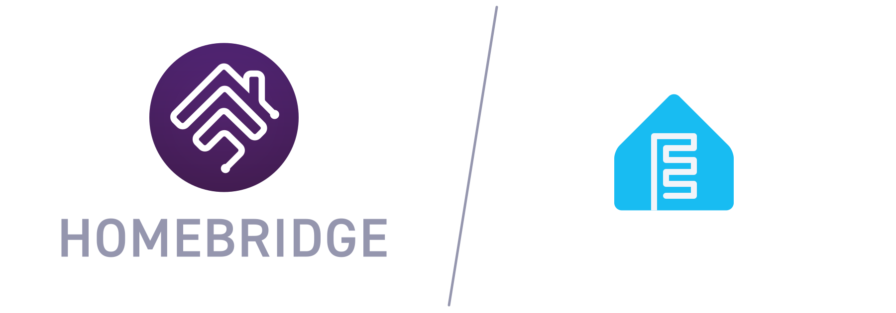

  

# homebridge-esphome-platform

Homebridge plugin for ESPHome devices using ESPHome Native API. Node.js bindings are used from the [esphomeapi](https://github.com/kovapatrik/esphomeapi) repository.

# Discovery

The plugin has an UI for a discovery process. All devices must be configured there. Every device/accessory must have a `mainEntity` selected as well, as this will be used at the primary service.

# HAP events

It's possible to forward HAP events to ESPHome devices which they can use to change their state as well. More information about this feature is on [ESPHome's website](https://esphome.io/components/api/#homeassistantevent-action).

The custom UI also helps wiring up these events.

# Supported Entities

- Switch
- Light

## License

Copyright (c) 2026 [Kovalovszky Patrik](https://github.com/kovapatrik)

Licensed under the Apache License, Version 2.0 (the "License"); you may not use this program except in compliance with the License. You may obtain a copy of the License at [http://www.apache.org/licenses/LICENSE-2.0](http://www.apache.org/licenses/LICENSE-2.0)

Unless required by applicable law or agreed to in writing, software distributed under the License is distributed on an "AS IS" BASIS, WITHOUT WARRANTIES OR CONDITIONS OF ANY KIND, either express or implied. See the License for the specific language governing permissions and limitations under the License.
